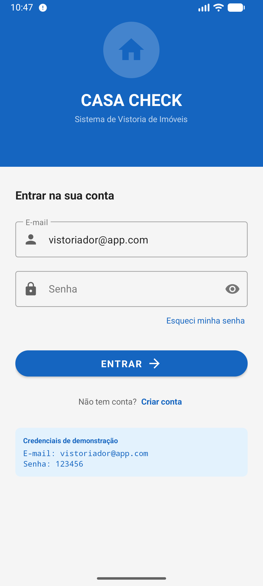
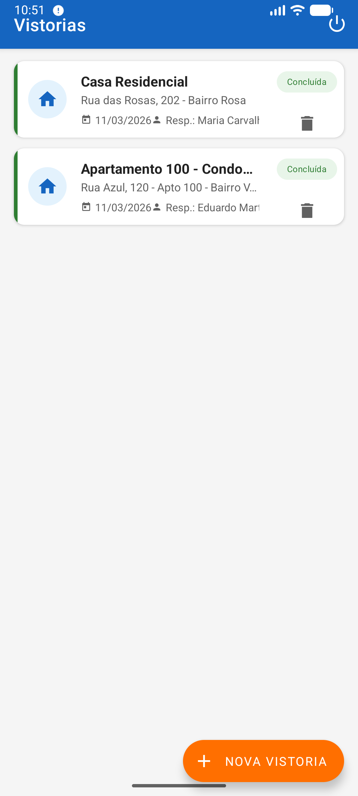
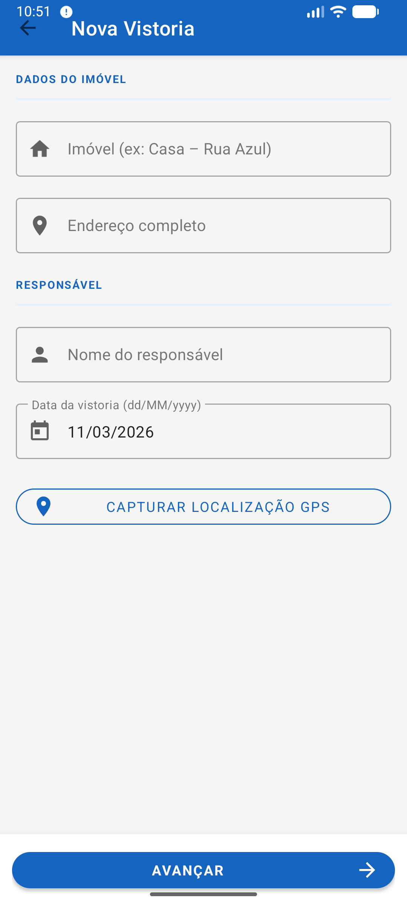
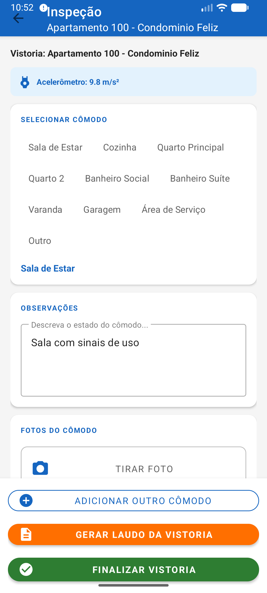
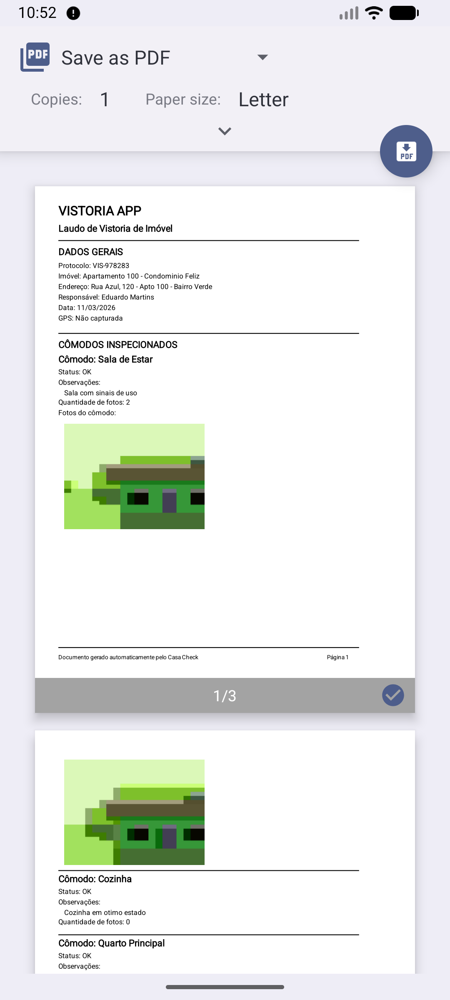
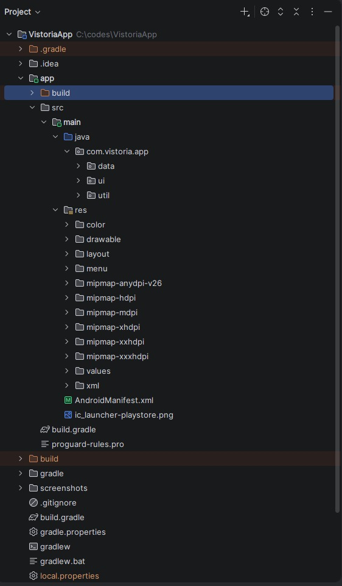
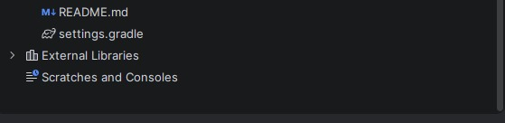

# 📱 CasaCheck – App de Vistoria de Imóveis

Aplicativo Android desenvolvido como **Atividade Parcial da disciplina Desenvolvimento para Plataformas Móveis **.

O objetivo do projeto é permitir o **registro completo de vistorias de imóveis diretamente pelo celular**, incluindo fotos, localização GPS, observações por cômodo e geração de laudo.

---

# 🎯 Sobre o Projeto

O **CasaCheck** é um sistema mobile para registro de inspeções de imóveis.

O aplicativo permite:

✔ Cadastrar vistorias com dados do imóvel  
✔ Capturar localização GPS automaticamente  
✔ Inspecionar cômodos com observações  
✔ Tirar fotos diretamente pela câmera  
✔ Detectar impactos usando acelerômetro  
✔ Gerar laudo em PDF da vistoria  
✔ Compartilhar o laudo gerado  
✔ Receber notificações ao finalizar inspeções

---

# 📸 Screenshots do Aplicativo

### Tela de Login

---

### Lista de Vistorias

---

### Cadastro de Vistoria

---

### Inspeção de Cômodos

---

### Laudo Gerado

---

# 📋 Requisitos da Atividade Atendidos

| Requisito | Implementação |
|--------|--------|
Material Design | Tema **MaterialComponents**, Cards, Chips, FAB, TextInputLayout |
GPS (sensor) | `FusedLocationProviderClient` no `CadastroVistoriaActivity` |
Câmera | `Intent ACTION_IMAGE_CAPTURE` + `FileProvider` |
Acelerômetro | `SensorManager.TYPE_ACCELEROMETER` na `InspecaoActivity` |
Notificações | `NotificationCompat` ao finalizar vistoria |
Armazenamento local | `SharedPreferences` + `Gson` |
Permissões runtime | `PermissaoHelper` |
3 Activities | Lista → Cadastro → Inspeção |
RecyclerView | Lista de vistorias |
Intent entre telas | `putExtra` / `getStringExtra` |

---

# 🛠️ Tecnologias Utilizadas

- **Android Studio**
- **Figma**
- **Java**
- **Android SDK**
- **Material Design**
- **RecyclerView**
- **PDFDocument**
- **Gson**
- **FileProvider**
- **FusedLocationProviderClient**
- **SensorManager**
- **NotificationCompat**

---

# 📱 Sensores Utilizados

## 📍 GPS – FusedLocationProviderClient

Usado em:

CadastroVistoriaActivity

Função:

- Capturar coordenadas do imóvel
- Registrar latitude e longitude
- Exibir no laudo

---

## 📷 Câmera – MediaStore.ACTION_IMAGE_CAPTURE

Usado em:

InspecaoActivity

Função:

- Abrir câmera nativa
- Salvar foto no armazenamento do app
- Exibir miniaturas das fotos

---

## 📊 Acelerômetro – SensorManager.TYPE_ACCELEROMETER

Usado em:

InspecaoActivity

Função:

- Monitorar movimento do dispositivo
- Detectar impactos acima de **15 m/s²**
- Registrar possível vibração estrutural

---

# 📁 Estrutura do Projeto

---

# 🔑 Permissões Utilizadas

| Permissão | Motivo |
|--------|--------|
ACCESS_FINE_LOCATION | Capturar GPS preciso |
ACCESS_COARSE_LOCATION | Localização aproximada |
CAMERA | Tirar fotos dos cômodos |
READ_MEDIA_IMAGES | Ler fotos no Android 13+ |
POST_NOTIFICATIONS | Notificação ao concluir vistoria |

---

# ▶️ Como Rodar o Projeto

### 1️⃣ Abrir no Android Studio

File → Open → selecionar pasta VistoriaApp

---

### 2️⃣ Sincronizar Gradle

Aguardar o Android Studio baixar dependências.

---

### 3️⃣ Executar o aplicativo

Selecionar:

Emulador Android
ou
Dispositivo físico

Clique em:

▶ Run

---

# ⚙️ Pré-requisitos

- Android Studio **Hedgehog ou superior**
- JDK **8+**
- Android SDK **API 24+**
- Gradle **8+**

---

# 👥 Equipe

| Nome | 
|-----|
|Lara Luisa F N Silva |
| Integrante 2 | 

---

# 🔗 Links

GitHub

[link do repositório]

APK do aplicativo

[link do APK]

---

# 📄 Licença

Projeto desenvolvido para fins **educacionais e acadêmicos**.
